## PediSmart Technical Specification: Driver & Passenger Discovery

### **Important Preliminary Note**

This document describes the discovery features as implemented in the provided codebase. It is crucial to acknowledge that this is an **early-stage implementation**. The current system relies on direct, manual selection and does not yet include a sophisticated, automated matchmaking algorithm. Furthermore, calculations for distance and ETA are based on "as-the-crow-flies" (haversine) distance and not on actual road network data from a routing engine. These are significant areas planned for future enhancement.

### 1.0 Overview

The "Discovery" phase in PediSmart is the critical two-way process where passengers find available drivers and drivers find potential passengers. This module's primary goal is to provide real-time situational awareness to both parties, facilitating the initiation of a ride. The system supports two primary modes of discovery:

1.  **Passive Discovery:** Visualizing nearby users on an interactive map.
2.  **Active Discovery:** Browsing a detailed list of users to make an informed, manual selection.

### 2.0 The Discovery Ecosystem: A High-Level Architecture

The discovery process is a coordinated effort between the passenger's app, the driver's app, and the Supabase backend. The backend uses PostgreSQL with the PostGIS extension for efficient geospatial queries.

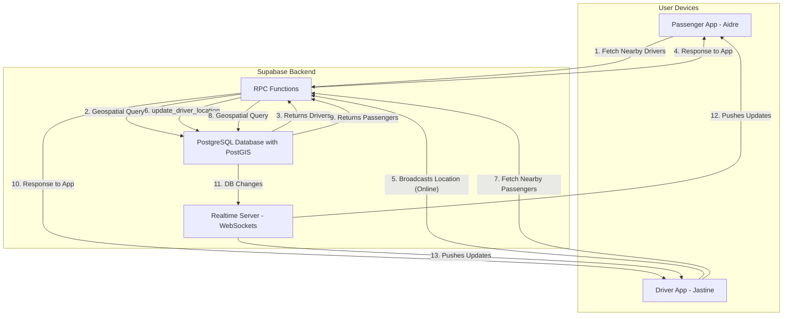

### 3.0 Passenger Perspective: "I need a ride!"

#### 3.1 User Story

> As **Aidre**, a passenger in Digos City, I want to see available pedicab drivers near me so that I can choose one and book a ride to my destination.

#### 3.2 Scenario

Aidre has just finished shopping at Gaisano Grand Mall in Digos and wants to get a ride home to her apartment near the Rizal Park. She opens the PediSmart app to find a driver.

#### 3.3 The Two Discovery Methods for Passengers

**Method A: Passive Discovery (Map View)**

*   **What happens:** Aidre opens the "Discover" tab. The map immediately centers on her current location (Gaisano). She sees several small pedicab icons moving on the map, representing online drivers like Jastine and Danniel who are in the vicinity. This gives her a quick overview of driver density.

**Method B: Active Discovery (Manual Booking List)**

*   **What happens:** For more detail, Aidre taps the "Browse Available Pedicabs" button. She is taken to a new screen that lists the same nearby drivers. Each driver's card shows:
    *   Full Name
    *   Plate Number
    *   Average Rating
    *   Estimated Time of Arrival (ETA) to her location.
    *   She can filter this list by a search radius ("within 1km").

#### 3.4 Under the Hood (Passenger Perspective)

The magic behind Aidre's experience is a combination of a powerful backend query and a real-time subscription.

**Sequence Diagram: Fetching Nearby Drivers**

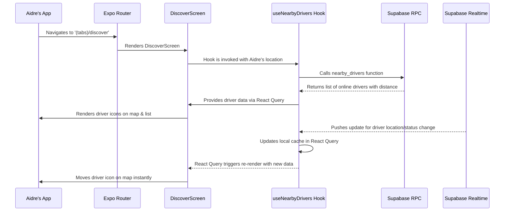

**Technical Breakdown:**

| Component                | Role & Responsibility                                                                                                                                                                                            |
| ------------------------ | ---------------------------------------------------------------------------------------------------------------------------------------------------------------------------------------------------------------- |
| **`PassengerDiscoverScreen`** | Renders the map and the location input components. It's the primary UI container for the passenger's discovery experience.                                                                                    |
| **`useNearbyDrivers` Hook** | This is the core logic engine. It performs the initial data fetch using React Query. Crucially, it also **subscribes to the `drivers` table via Supabase Realtime**. Any `UPDATE` to a driver's `current_location` or `status` is pushed to the app, which updates the local data cache, causing the UI to re-render without a full API call. |
| **`nearby_drivers` RPC** | A server-side PostgreSQL function. It takes the passenger's coordinates and a radius as input and uses **PostGIS's `ST_DWithin` function** to efficiently query the database for all drivers within that geographical boundary. This is far more performant than fetching all drivers and filtering on the client. |

### 4.0 Driver Perspective: "I need a passenger!"

#### 4.1 User Story

> As **Jastine**, a pedicab driver in Digos City, I want to go online to make myself visible to nearby passengers and see if anyone is looking for a ride so that I can earn income.

#### 4.2 Scenario

Jastine has just started her shift and is positioned near the Digos City Bus Terminal, a high-traffic area. She opens the PediSmart app and toggles her status to "Online" to begin looking for passengers like Aidre or Danniel.

#### 4.3 The Two Discovery Methods for Drivers

**Method A: Passive Discovery (Receiving Requests)**

*   **What happens:** Once Jastine is online, her location is broadcast to the system. If a passenger like Aidre uses the "Manual Booking" screen and selects Jastine, a request modal will pop up on Jastine's screen, which she can accept or decline.

**Method B: Active Discovery (Find Passengers List)**

*   **What happens:** Jastine navigates to the "Find" tab. The app shows her a list of passengers who have an active ride request (`status = 'requested'`). She sees a card for a passenger named **Danniel**, who is at the local market and needs a ride. The card shows Danniel's name, rating, and his pickup location. Jastine can tap on this card to proactively offer Danniel a ride.

#### 4.4 Under the Hood (Driver Perspective)

For the driver, discovery involves two key actions: broadcasting their own presence and querying for the presence of others.

**Sequence Diagram: Going Online and Finding Passengers**

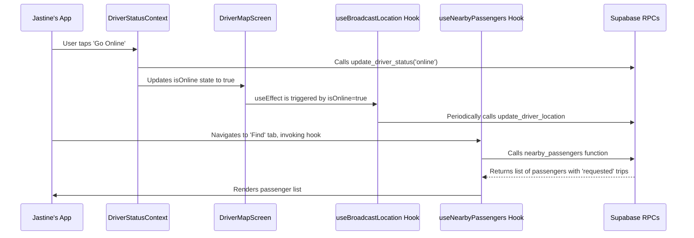

**Technical Breakdown:**

| Component                   | Role & Responsibility                                                                                                                                                                                                                         |
| --------------------------- | --------------------------------------------------------------------------------------------------------------------------------------------------------------------------------------------------------------------------------------------- |
| **`DriverStatusContext`**   | Manages the driver's online/offline state. Toggling the status updates the backend and triggers location broadcasting.                                                                                                                         |
| **`useBroadcastLocation` Hook** | A "fire-and-forget" mutation that is called periodically (every 15 seconds) when the driver is online. It sends the driver's current coordinates to the `update_driver_location` RPC, which updates the `current_location` field in the `drivers` table. |
| **`useNearbyPassengers` Hook** | This hook polls the `nearby_passengers` RPC every 15 seconds to fetch a fresh list of passengers seeking rides. This is a polling mechanism, not a real-time subscription, as the list of potential passengers is expected to change less frequently than a single driver's location. |
| **`nearby_passengers` RPC** | Similar to its driver counterpart, this server-side function uses PostGIS to find all trips with a status of `"requested"` and a pickup waypoint within the specified radius of the driver.                                                  |

### 5.0 The "Handshake": Connecting Passenger and Driver

This is the process where discovery transitions into a confirmed ride.

#### Flow A: Passenger-Initiated Request (Manual Booking)

Aidre sees Jastine in the list and decides to request a ride.

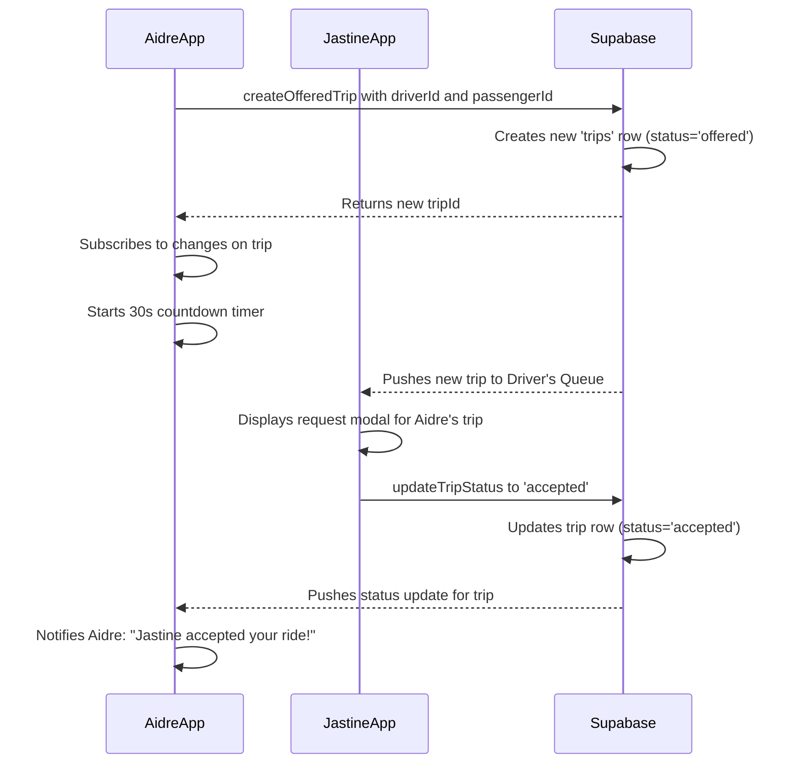

#### Flow B: Driver-Initiated Offer

Jastine sees Danniel in her "Find Passengers" list and offers him a ride.

1.  **Offer:** Jastine taps on Danniel's card. This triggers the `useOfferRide` hook, which creates a new trip with the status `"offered"`, assigning Jastine as the driver and Danniel as the passenger.
2.  **Notification:** A real-time event is pushed to Danniel's app. The `usePassengerOfferSubscription` hook catches this event and displays a modal: "Jastine has offered you a ride. Accept/Decline?"
3.  **Response:** If Danniel accepts, the trip status is updated to `"accepted"`, and both users transition to the "On Trip" state. If he declines, the status becomes `"declined"`.

## Core Application & Authentication

### 1.0 Overview

The Core App & Authentication module is the foundational layer of the PediSmart application. It is responsible for managing user identity, securing access to the application, and directing users to the appropriate interface based on their designated role (Passenger or Driver). This module ensures a secure, persistent, and role-aware user experience.

The architecture is built around a centralized authentication context that interacts with a secure backend (Supabase), providing a single source of truth for user session and profile data throughout the application.

### 2.0 Key Technologies & Services

The following table outlines the primary technologies and services that constitute the core architecture.

| Component                 | Technology/Service          | Purpose                                                                                                 |
| ------------------------- | --------------------------- | ------------------------------------------------------------------------------------------------------- |
| **Authentication Backend**| Supabase Auth               | Handles user registration, login, session management, and JWT issuance.                                 |
| **Database**              | Supabase (PostgreSQL)       | Stores user profiles, roles, and other application data.                                                |
| **Routing**               | Expo Router (File-based)    | Manages navigation and enforces access control through layout-based route protection.                   |
| **State Management**      | React Context & React Query | Provides a centralized `AuthContext` for session state and uses React Query for caching profile data. |
| **Secure Storage**        | Expo Secure Store & AES-js  | A custom wrapper (`LargeSecureStore`) to securely encrypt and store user session data on the device.      |

### 3.0 Authentication Flow

The authentication flow governs the user's journey from launching the app to accessing their role-specific dashboard. The process is designed to be seamless while ensuring that access is always validated.

The following sequence diagram illustrates the complete authentication and initialization flow:

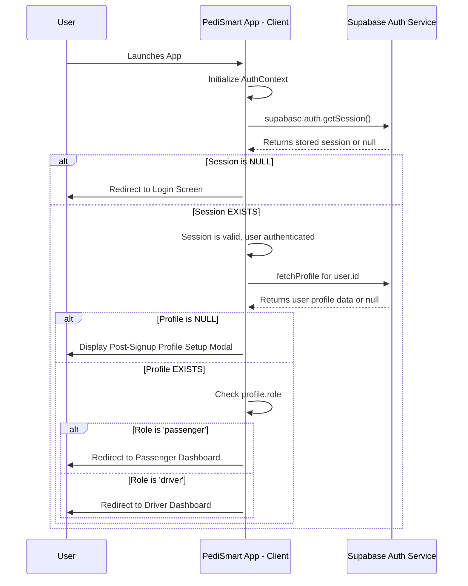

### 4.0 Authorization & Role-Based Access Control (RBAC)

Authorization is managed through a simple but effective role-based system. A user's role is assigned at signup and stored in the `profiles` table. This role dictates which parts of the application the user can access.

The primary mechanism for enforcing RBAC is the root layout file (`/app/_layout.tsx`), which acts as a navigational guard.

#### 4.1 RBAC Logic Flow

The decision-making process for routing an authenticated user is as follows:

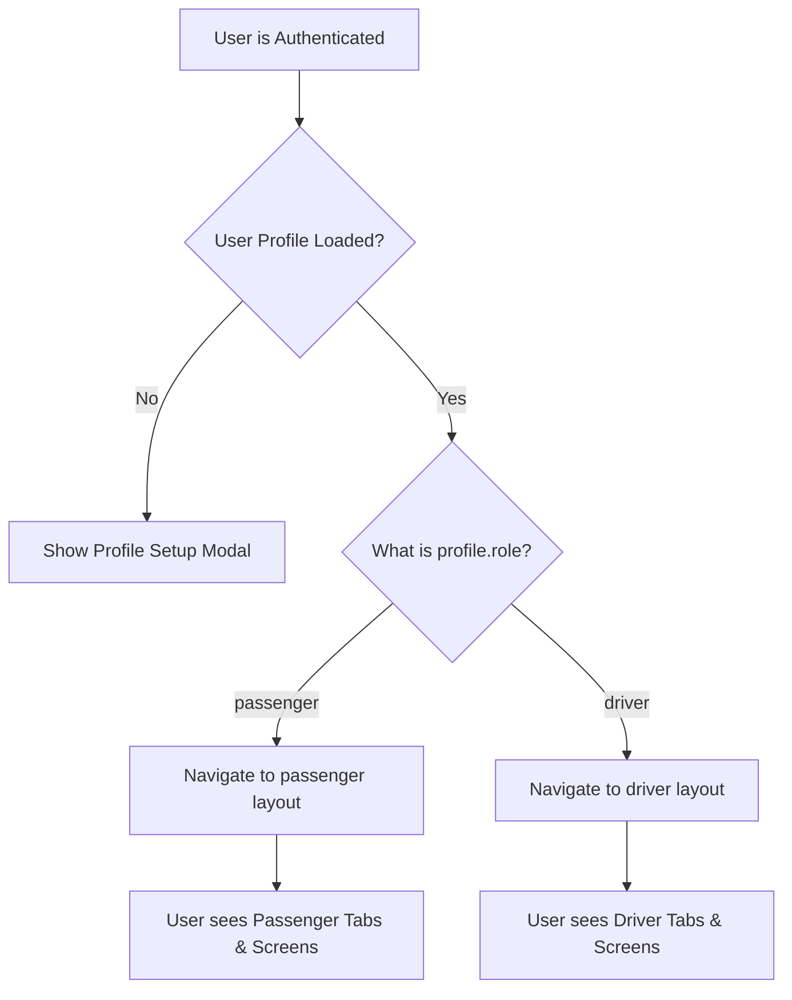

This structure effectively segregates the two main application experiences, preventing users from accessing screens or features not intended for their role.

### 5.0 Session Management

User sessions are designed to be persistent and secure, leveraging Supabase's built-in session management and a custom secure storage solution.

| Feature               | Implementation Details                                                                                                                                                                                                                                                        |
| --------------------- | ----------------------------------------------------------------------------------------------------------------------------------------------------------------------------------------------------------------------------------------------------------------------------- |
| **Session Persistence** | The `persistSession: true` option in the Supabase client ensures the user's session is saved between app launches.                                                                                                                                                          |
| **Auto-Refresh**      | The `autoRefreshToken: true` option automatically refreshes the JWT access token in the background, keeping the user logged in without requiring manual re-authentication. This is managed by an `AppState` listener to optimize background activity.                      |
| **Secure Storage**    | A custom `LargeSecureStore` class is implemented to overcome `expo-secure-store` size limitations. It uses a hybrid approach: an AES encryption key is stored in `SecureStore`, while the larger, encrypted session data is stored in `AsyncStorage`, ensuring both security and capacity. |

### 6.0 Data Flow & State Management

Authentication state is managed globally via a React Context (`AuthContext`) to provide easy and efficient access to user and session data from any component in the application.

#### 6.1 `AuthContext` Properties

The `useAuth()` hook exposes the following state properties:

| Property            | Type                  | Description                                                                                             |
| ------------------- | --------------------- | ------------------------------------------------------------------------------------------------------- |
| `session`           | `Session \| null`       | The full Supabase session object, including the access token. Null if not authenticated.                |
| `user`              | `User \| null`          | The Supabase user object, containing the user's ID, email, and metadata.                                |
| `profile`           | `Profile \| null`       | The user's profile data from the `profiles` table, including `full_name` and `role`.                    |
| `isLoading`         | `boolean`             | `true` while the initial session and profile are being fetched; `false` otherwise.                      |
| `needsProfileSetup` | `boolean`             | `true` if the user is authenticated but has not yet completed their profile (set their full name). |
| `logout()`          | `() => Promise<void>` | A function to sign the user out, clear the session, and invalidate all cached data.                     |
| `createProfile()`   | `(...) => Promise<void>` | A function used by the post-signup modal to create the user's initial profile record in the database. |

By centralizing this logic, the application avoids prop-drilling and ensures that components automatically re-render when the authentication state changes.

***

## Passenger Module

### 1.0 Overview

The Passenger Module provides the complete suite of features for users registered with the "passenger" role. This module is designed to facilitate a seamless ride-hailing experience, from discovering nearby drivers to booking a ride, tracking its progress, and providing feedback.

The user interface is organized into a tab-based layout for intuitive access to key functionalities. Real-time data synchronization with the backend is a critical component, ensuring that passengers always have up-to-date information about driver locations and trip status.

### 2.0 Module Architecture & Key Components

The passenger experience is encapsulated within the `/app/(app)/passenger/` directory, which contains both the tabbed layout and modal screens for specific workflows.

| Component                 | Location                                   | Purpose                                                                                                                                              |
| ------------------------- | ------------------------------------------ | ---------------------------------------------------------------------------------------------------------------------------------------------------- |
| **Tab Navigator**         | `(app)/passenger/(tabs)/_layout.tsx`       | Defines the main navigation structure: Discover, Rides, History, and Profile.                                                                        |
| **Discover (Map) Screen** | `(app)/passenger/(tabs)/discover.tsx`      | The primary map interface for viewing nearby drivers and initiating the booking process.                                                               |
| **Manual Booking Screen** | `(app)/passenger/manual-booking.tsx`       | A modal screen that presents a detailed list of available drivers, allowing for direct, targeted ride requests.                                        |
| **Location Selection**    | `(app)/passenger/locate.tsx`               | A reusable modal map for setting precise pickup and destination points.                                                                              |
| **Rides Management**      | `(app)/passenger/(tabs)/bookings.tsx`      | Displays the user's current active trip and a history of past rides.                                                                                 |
| **Offer History**         | `(app)/passenger/(tabs)/history.tsx`       | A log of all ride offers received from drivers, showing their status (accepted/declined).                                                            |
| **Rating Screen**         | `(app)/passenger/rating.tsx`               | A modal screen for submitting a star rating and comment after a trip is completed.                                                                   |
| **Hooks & Services**      | `src/features/map/`, `src/features/booking/` | Contains React Query hooks (`useNearbyDrivers`, `useCurrentTrip`) and services (`bookingService`) that power the module's data fetching and mutations. |

### 3.0 Feature Breakdown

#### 3.1 Discover & Map View

The "Discover" tab serves as the passenger's home screen. Its primary purpose is to provide situational awareness of available transportation.

**Workflow Diagram:**

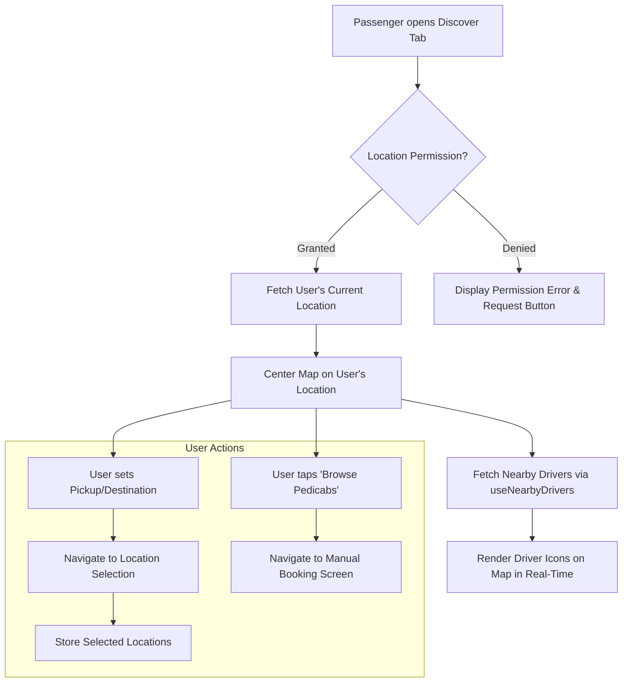

**Technical Details:**

*   **Real-Time Driver Locations:** The `useNearbyDrivers` hook establishes a real-time subscription to the `drivers` table in Supabase. This ensures that driver icons on the map move and appear/disappear instantly without requiring manual refreshes.
*   **Performance:** To maintain a smooth user experience, a maximum of 50 drivers are rendered on the map at any given time.
*   **Active Trip Display:** When a trip becomes active, the `useCurrentTrip` hook provides the assigned driver's live location, which is rendered with a distinct icon, allowing the passenger to track their approach.

#### 3.2 Manual Ride Booking

This feature provides an alternative to automated matchmaking, giving passengers more control over their choice of driver.

**Key Features & Implementation:**

| Feature                | Implementation Details                                                                                                                                                                    |
| ---------------------- | ----------------------------------------------------------------------------------------------------------------------------------------------------------------------------------------- |
| **Driver List**        | The `useNearbyDrivers` hook is reused to fetch a list of available drivers. Each driver is displayed in a card with their name, plate number, and average rating.                             |
| **Search Radius**      | The hook's `radiusInMeters` parameter is dynamically updated based on the user's selection (1km, 3km, 5km, 10km). Changing the radius triggers a new data fetch.                               |
| **Auto-Expand Search** | A `useEffect` hook monitors the query results. If the driver list is empty and the `autoExpand` flag is true, it automatically re-triggers the query with a larger radius (10km).         |
| **Direct Request**     | Tapping a driver initiates the `createOfferMutation` (a React Query mutation). This calls `bookingService.createOfferedTrip`, which creates a new trip record with a status of `"offered"`. |
| **Request Timeout**    | A `useEffect` hook manages a 30-second countdown. If the trip status is not updated to `"accepted"` within this time, the mutation is cancelled and the trip status is set to `"cancelled"`. |
| **Real-Time Response** | A Supabase Realtime channel is subscribed to the newly created trip's ID. It listens for `UPDATE` events to immediately notify the UI if the trip is accepted or declined by the driver.   |

#### 3.3 Ride & Offer Management

This module component allows passengers to track their trip status and history.

**Data Flow Diagram:**

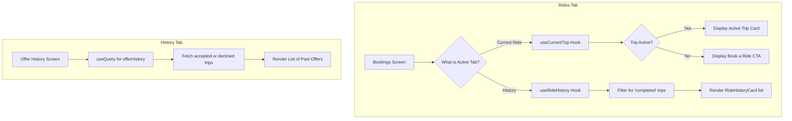

*   **`useCurrentTrip`:** This hook is fundamental to the "Current Ride" view. It efficiently fetches and subscribes to real-time updates for any trip where the user is the passenger and the status is active (`requested`, `accepted`, `in_progress`).
*   **`useRideHistory`:** This hook fetches all trips associated with the user and caches the result, providing a responsive history list.

#### 3.4 Post-Trip Rating

This feature is crucial for maintaining the quality of the driver network.

**Workflow:**

1.  **Trigger:** After a trip's status becomes `"completed"`, the `RideHistoryCard` component displays a "Rate Trip" button.
2.  **Navigation:** Tapping the button navigates the user to the `/passenger/rating` modal screen, passing the `tripId` and the driver's ID (`rateeId`) as route parameters.
3.  **Submission:** The `RatingForm` component captures the star rating and optional comment. On submission, it calls the `useSubmitRating` mutation.
4.  **Backend Update:** The mutation calls `bookingService.submitRating`, which inserts a new row into the `ratings` table.
5.  **UI Feedback:** Upon successful submission, the `onSuccess` callback is triggered, and the user is navigated back to the previous screen. The ride history query is invalidated to reflect the submitted rating.

***

## Driver Module

### 1.0 Overview

The Driver Module is a comprehensive toolset designed for users registered with the "driver" role. It equips drivers with all necessary functionalities to manage their availability, find passengers, handle ride requests, navigate trips, and track their performance. The module is engineered for high reliability and real-time responsiveness, which are critical for a driver's operational efficiency.

The architecture prioritizes a clear separation of states—**Offline**, **Online & Searching**, and **On Trip**—each presenting a tailored user interface and activating specific background processes like location broadcasting.

### 2.0 Module Architecture & Key Components

The driver experience is primarily located within the `/app/(app)/driver/` directory.

| Component                       | Location                                    | Purpose                                                                                                                                                               |
| ------------------------------- | ------------------------------------------- | --------------------------------------------------------------------------------------------------------------------------------------------------------------------- |
| **Tab Navigator**               | `(app)/driver/(tabs)/_layout.tsx`           | Defines the driver's main navigation: Dashboard, Find, Queue, Rides, and Profile.                                                                                     |
| **Driver Dashboard (Map)**      | `(app)/driver/(tabs)/dashboard.tsx`         | The main operational screen, displaying the driver's map, performance stats, and transitioning into the Trip Navigation view when a trip is active.                    |
| **Find Passengers Screen**      | `(app)/driver/(tabs)/find.tsx`              | A list-based view of nearby passengers actively seeking rides, allowing drivers to proactively offer a ride.                                                        |
| **Manual Confirmation Queue**   | `(app)/driver/(tabs)/queue.tsx`             | A dedicated screen to manage and respond to direct ride requests sent by passengers.                                                                                  |
| **Trip Navigation Screen**      | `src/features/trip/screens/TripNavigationScreen.tsx` | A full-screen, interactive map and UI for turn-by-turn navigation during an active trip. This component is rendered *within* the Dashboard screen when a trip is active. |
| **Driver Status Management**    | `src/contexts/DriverStatusContext.tsx`      | A global context providing state (`isOnline`) and actions (`toggle`) for the driver's availability. This context controls location broadcasting and visibility to passengers. |
| **Hooks & Services**            | `src/features/map/`, `src/features/booking/` | Contains key React Query hooks (`useNearbyPassengers`, `useDriverStats`) and services that manage data fetching, real-time subscriptions, and backend mutations. |

### 3.0 Feature Breakdown

#### 3.1 Driver Availability & Dashboard

This is the central hub for the driver. The core functionality is the ability to manage their work status, which dictates all other interactions.

**State Machine Diagram:**

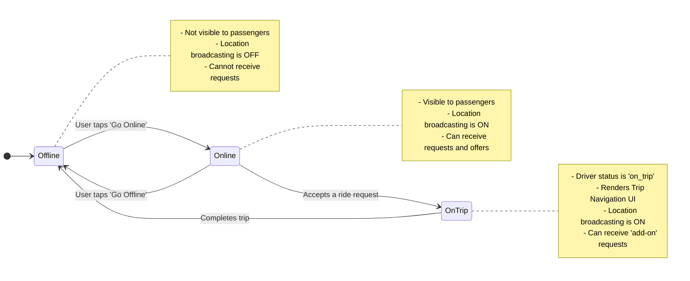

**Implementation Details:**

*   **`DriverStatusContext`**: This context wraps the entire driver tab layout, providing a single source of truth for the `isOnline` state.
*   **`AvailabilityToggle` Component**: This UI component calls the context's `toggle()` function. This function updates the `drivers` table in Supabase to set the status to `"online"` or `"offline"`.
*   **Location Broadcasting**: A `useEffect` hook in the `DriverMapScreen` is triggered by the `isOnline` state. When `true`, it uses the `useBroadcastLocation` mutation to periodically send the driver's coordinates to the backend. This process is automatically paused when the driver goes offline or a trip is completed.
*   **Dashboard Stats**: The `useDriverStats` hook calls a Supabase RPC (`get_driver_stats`) to fetch aggregated data: total trips, average rating, and hours online. This data is displayed in prominent summary cards.

#### 3.2 Finding & Accepting Passengers

PediSmart provides drivers with two distinct methods for acquiring passengers: proactively offering rides and passively accepting incoming requests.

**1. Proactive - Find Passengers (List View)**

*   **Data Fetching**: The `useNearbyPassengers` hook polls the backend every 15 seconds, calling the `nearby_passengers` RPC to find passengers with `"requested"` trips within a 5km radius.
*   **UI Presentation**: Each passenger is shown in a `PassengerInfoCard` with their name, rating, and a calculated ETA.
*   **Offering a Ride**: Tapping a card triggers the `acceptRideMutation` (from the `FindPassengersScreen`). This immediately updates the trip's status to `"accepted"` and assigns the current driver. This action is atomic and "first-come, first-served."

**2. Reactive - Real-Time Ride Requests**

*   **Subscription**: The `useRideRequestsSubscription` hook establishes a real-time subscription to new trip insertions. It is only active when the driver is online and not on a trip.
*   **Request Modal**: When a new request is received, the `RideRequestModal` is displayed with trip details and a countdown timer.
*   **Accept/Decline**: The modal's buttons trigger mutations that call `bookingService.updateTripStatus` to set the trip's status to either `"accepted"` or `"declined"`.

#### 3.3 Trip Navigation & Management

Once a trip is active (status is `"accepted"` or `"in_progress"`), the `DriverMapScreen` renders the `TripNavigationScreen` component, transforming the UI into a dedicated navigation tool.

**Navigation Logic Flow:**

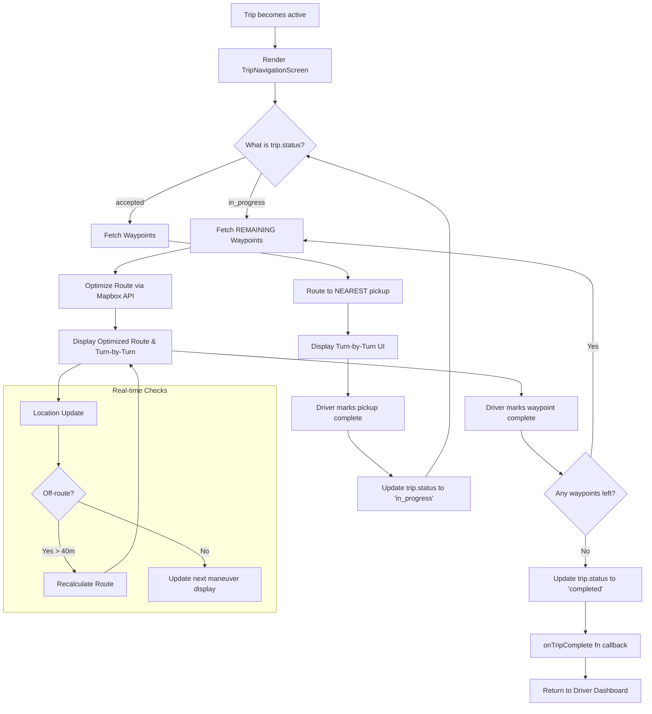

**Technical Implementation:**

*   **Multi-Stop Route Optimization**: The core of this feature is `routingService.optimizeRoute`. It sends the driver's start location and all remaining waypoints to the Mapbox Optimization API. This API returns the most efficient travel order and a route polyline, which is then rendered on the map.
*   **Turn-by-Turn Guidance**: The route response from Mapbox includes a detailed list of steps and maneuvers. A `useEffect` hook continuously compares the driver's live location to these steps to determine and display the next instruction (e.g., "Turn left in 50m").
*   **Off-Route Detection**: The driver's coordinates are periodically checked against the route's polyline using the `pointToLineDistanceMeters` helper function. If the distance exceeds a threshold (40 meters) multiple times, a route recalculation is automatically triggered.
*   **Multi-Passenger "Add-On"**: While a trip is `"in_progress"`, the `useRideRequestsSubscription` remains active. If a new request is accepted, `bookingService.addPassengerToActiveTrip` adds the new waypoints to the trip, and the navigation logic automatically re-optimizes the route to include them. The `useTripCapacity` hook ensures the vehicle's passenger limit is not exceeded.
*   **State Management**: Waypoint completion is handled via mutations that update the waypoint status in the backend. This triggers a refetch of the remaining waypoints and a subsequent route recalculation.

***

## PediSmart Technical Specification: Shared & Technical Features

### 1.0 Overview

This document outlines the shared modules, core technical architecture, and cross-cutting concerns that support both the Passenger and Driver functionalities within the PediSmart application. These features provide the foundational services for data management, real-time communication, offline capabilities, and a consistent user experience.

### 2.0 Unified Profile Management

A single, adaptable profile module serves both user roles, promoting code reuse and a consistent interface. The profile screen and its related hooks are responsible for fetching, displaying, and updating user data.

**Location:** `src/features/profile/`

**Component Diagram:**

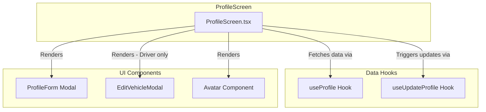

**Key Features:**

| Feature                | Implementation Details                                                                                                                                                                                                           |
| ---------------------- | -------------------------------------------------------------------------------------------------------------------------------------------------------------------------------------------------------------------------------- |
| **Unified Data Fetching**| The `useProfile` hook fetches data for the currently authenticated user. It intelligently checks the user's `role` and, if the role is `"driver"`, it makes an additional request to fetch data from the `drivers` table, merging the results into a single `DriverProfile` object. |
| **Conditional Rendering**| The `ProfileScreen.tsx` component checks the `profile.role` property to conditionally render driver-specific UI elements, such as the vehicle information card and the "Edit Vehicle" button. This allows a single screen to adapt to both user types. |
| **Avatar Management**  | The `Avatar` component handles both displaying the current avatar and uploading a new one. It uses `expo-image-picker` to access the device's gallery and uploads the selected image to Supabase Storage. The `onUpload` callback triggers the `useUpdateProfile` hook to save the new image path to the user's profile. |
| **Profile Updates**    | The `ProfileForm` and `EditVehicleModal` components use the `useUpdateProfile` hook. This hook abstracts the logic for updating the `profiles` and/or `drivers` tables. Upon a successful update, it invalidates the `['profile', userId]` React Query key to ensure the UI is refreshed with the latest data. |

### 3.0 Real-Time Backend & Data Synchronization

The application's real-time capabilities are powered by Supabase Realtime, which uses WebSockets to push database changes to connected clients instantly.

**Real-Time Architecture:**

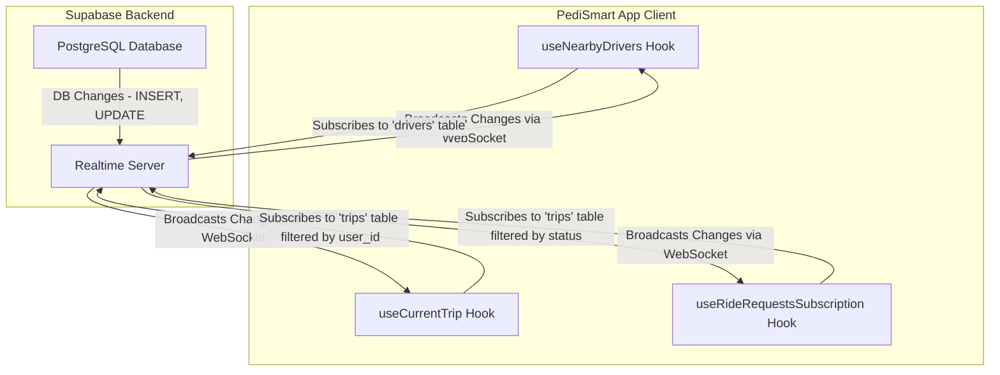

**Implementation Details:**

*   **Subscriptions in Hooks:** Real-time subscriptions are managed within custom React hooks. A `useEffect` hook is used to establish the subscription when the component mounts and to unsubscribe when it unmounts, preventing memory leaks.
*   **Targeted Subscriptions:** Filters are applied to subscriptions to minimize unnecessary data transfer. For example, the `useCurrentTrip` hook listens for changes only on the specific `trip.id` of the active trip.
*   **React Query Integration:** When a real-time event is received, instead of directly setting component state, the client **invalidates the relevant React Query key** (e.g., `queryClient.invalidateQueries({ queryKey: ['currentTrip', userId] })`). This triggers a refetch, ensuring the app's global state and cache are updated, and all components observing that data are re-rendered consistently.

### 4.0 Offline Support Framework

The application is designed to be resilient to network interruptions by implementing an offline-first strategy for critical actions.

**Location:** `src/lib/offline/`, `src/hooks/useOfflineActions.ts`

**Offline Architecture Flow:**

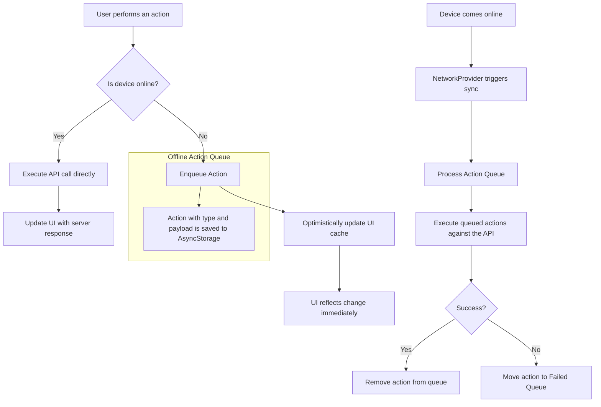

**Key Components:**

| Component                | Responsibility                                                                                                                                                             |
| ------------------------ | -------------------------------------------------------------------------------------------------------------------------------------------------------------------------- |
| **`NetworkContext`**     | A global context that provides the application-wide connection status (`isConnected`). It listens to `NetInfo` and triggers the sync process when the device comes back online. |
| **`OfflineActionQueue`** | A class that manages two queues stored in `AsyncStorage`: a main queue for pending actions and a failed queue for actions that could not be completed after multiple retries. |
| **`ActionExecutors`**    | A mapping of action types (e.g., `"trip.end"`) to the corresponding service functions that execute the API call (e.g., `bookingService.updateTripStatus(...)`).            |
| **`OfflineDataManager`** | A singleton class that manages caching of key data (current trip, profile, etc.) in `AsyncStorage`. This allows the app to read data and function in a limited capacity while offline. |
| **`useOfflineAwareMutation`** | A custom React Query hook that wraps around a standard mutation. It checks the network status before executing. If online, it calls the API; if offline, it enqueues the action. |

### 5.0 Map Technology

The application relies on **Mapbox** for all mapping and navigation features, chosen for its performance, customizability, and advanced APIs.

**Location:** `src/lib/mapbox.ts`, `src/services/routingService.ts`

**Key Features Used:**

| Feature                      | Mapbox Product/API                                 | Use Case                                                                                                                                            |
| ---------------------------- | -------------------------------------------------- | --------------------------------------------------------------------------------------------------------------------------------------------------- |
| **Map Rendering**            | Mapbox Maps SDK for React Native (`@rnmapbox/maps`) | Renders the main interactive maps for both passengers and drivers. Custom map styles (e.g., `navigation-day-v1`) are used for a clean look. |
| **Route Optimization**       | Mapbox Optimization API                            | Calculates the most efficient multi-stop route for drivers, considering traffic and pickup/drop-off constraints. Used in `TripNavigationScreen`. |
| **Directions & Navigation**  | Mapbox Directions API                              | Provides the detailed route geometry (polyline) and turn-by-turn maneuver instructions for the navigation UI.                                     |
| **Geocoding & Search**       | Expo Location (wrapper for geocoding services)     | Converts map coordinates into human-readable addresses (reverse geocoding) in the `LocationSelectionScreen`.                                      |
| **Data-Driven Styling**      | `@rnmapbox/maps` SymbolLayer & LineLayer           | Used to render driver icons, route lines, and waypoint markers on the map dynamically based on data from the application state.                   |

***

## Database Schema (ERD)

### 1.0 Overview

This document provides a detailed visualization and explanation of the PediSmart application's PostgreSQL database schema, as managed by Supabase. The schema is designed to be relational, scalable, and efficient, with a clear separation of concerns between user identity, role-specific data, and transactional trip information.

The core of the schema revolves around the `profiles` table, which serves as the central identity hub linked to Supabase's `auth.users` table. All other data, such as trips, ratings, and driver-specific details, are relationally linked back to this central entity. The use of PostGIS for geospatial data is fundamental for location-based features.

### 2.0 Full Entity Relationship Diagram (ERD)

The following diagram illustrates the complete data model, including all tables, columns, data types, and the relationships between them.

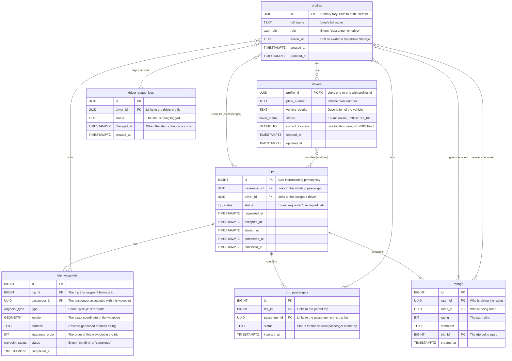

### 3.0 Entity & Relationship Breakdown

#### 3.1 `profiles`
*   **Purpose:** The central table for all users. It stores identity information common to both passengers and drivers. The `id` column is a foreign key that references the `id` in Supabase's `auth.users` table, linking authentication to user data.
*   **Key Relationships:**
    *   **`drivers` (One-to-One):** A profile with `role = 'driver'` has a corresponding entry in the `drivers` table, which holds driver-specific information.
    *   **`trips` (One-to-Many):** A profile can be associated with many trips, either as a `passenger_id` or a `driver_id`.
    *   **`ratings` (One-to-Many):** A profile can give many ratings (`rater_id`) and receive many ratings (`ratee_id`).

#### 3.2 `drivers`
*   **Purpose:** An extension of the `profiles` table, containing data exclusively for drivers. This separation keeps the `profiles` table clean and normalizes the data.
*   **Key Columns & Relationships:**
    *   `profile_id`: This is both the Primary Key and a Foreign Key to `profiles.id`, enforcing a strict one-to-one relationship.
    *   `current_location`: A crucial `GEOMETRY` (Point) column powered by PostGIS, enabling efficient geospatial queries for finding nearby drivers.

#### 3.3 `trips`
*   **Purpose:** The primary transactional table that records every ride request from initiation to completion. It acts as the central hub connecting passengers, drivers, and the journey itself.
*   **Key Relationships:**
    *   **`trip_waypoints` (One-to-Many):** Each trip is composed of at least two waypoints (one pickup, one dropoff).
    *   **`trip_passengers` (One-to-Many):** For multi-passenger trips, this table links all participating passengers to a single trip.
    *   **`ratings` (One-to-Many):** A completed trip can have multiple associated ratings (e.g., driver rates passenger, passenger rates driver).

#### 3.4 `trip_passengers`
*   **Purpose:** This linking table enables the multi-passenger (pool) feature. It allows a single trip, managed by one driver, to officially contain multiple, distinct passengers.
*   **Key Columns & Relationships:**
    *   `trip_id`: Links to the parent trip record.
    *   `passenger_id`: Links to the profile of the passenger on this leg of the trip.
    *   `status`: Tracks the individual passenger's state within the larger trip (e.g., `pending`, `picked_up`, `dropped_off`).

#### 3.5 `trip_waypoints`
*   **Purpose:** Stores the specific geographical points that make up a trip's itinerary.
*   **Key Columns & Relationships:**
    *   `type`: An `ENUM` that defines the waypoint's purpose (`pickup` or `dropoff`).
    *   `location`: A `GEOMETRY` column storing the precise coordinates.
    *   `sequence_order`: Defines the optimized order in which the driver should visit the waypoints.

#### 3.6 `ratings`
*   **Purpose:** A table to store feedback after a trip is completed. It allows for a bidirectional rating system.
*   **Key Columns & Relationships:**
    *   `rater_id` & `ratee_id`: Two separate foreign keys to the `profiles` table to distinguish who gave the rating and who received it.
    *   `trip_id`: Ensures that every rating is tied to a specific, completed trip.

#### 3.7 `driver_status_logs`
*   **Purpose:** An audit table for tracking a driver's availability history. This can be used for analytics, such as calculating total online hours or understanding driver behavior patterns.
*   **Key Relationships:**
    *   `driver_id`: Links back to the `profiles` table to identify the driver whose status changed.

### 4.0 Custom Database ENUM Types

To ensure data integrity and consistency, the schema utilizes several custom PostgreSQL `ENUM` types.

| Enum Name         | Possible Values                                                     | Used In               |
| ----------------- | ------------------------------------------------------------------- | --------------------- |
| `user_role`       | `passenger`, `driver`                                               | `profiles`            |
| `driver_status`   | `online`, `offline`, `on_trip`                                      | `drivers`             |
| `trip_status`     | `requested`, `accepted`, `in_progress`, `completed`, `cancelled`, `offered`, `declined` | `trips`               |
| `waypoint_type`   | `pickup`, `dropoff`                                                 | `trip_waypoints`      |
| `waypoint_status` | `pending`, `completed`                                              | `trip_waypoints`      |
